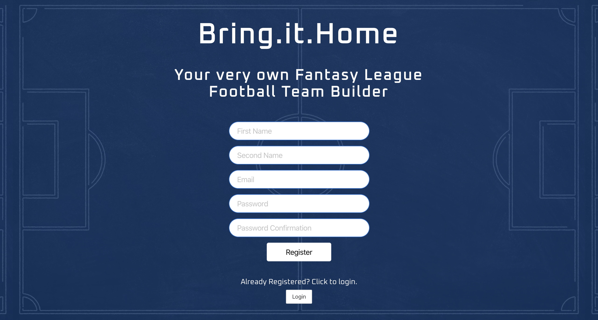
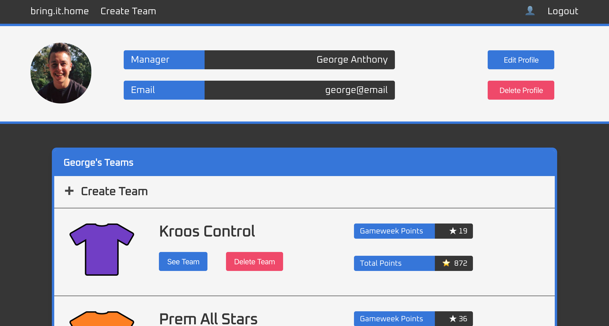

# Software Engineering Immersive: Project 4
This is my fourth project of the General Assembly Software Engineering Immersive course (Week 11). It was a 7 day solo project.

## Installation

* Clone or download the Repository
* From the project root folder, enter the following commands into the terminal:

```
<!— To install all the packages listed in the package.json: —> $ yarn 

<!- Navigate into the shell -> $ pipenv shell

<!— Run the front-end app : —> $ python manage.py runserver

<!— Run the front-end app : —> $ yarn start

<!— Check the console for any issues and if there are any then check the package.json for any missing dependencies —>

<!- Navigate to http://localhost:4000/>
```

## Deployment

The game is deployed on Heroku and can be found [here](bring-it-home.herokuapp.com).

## Technologies Used

* PostgreSQL
* Python
* Django
* React
* Node.js
* Express
* Axios
* SCSS
* Bulma
* Google Fonts
* Git
* GitHub
* Fantasy Premier League API

## Website Architecture

### Overview

The purpose of the website is to enables users to create a profile and build several Premier League fantasy football teams, within a budget, to compare and contrast the performance of various combinations of players. The user is able to search from a dataset of every player in the Premier League and swap them into their team, if their budget allows them to.

### Fantasy League API

The Fantasy League API is a large JSON file (over 36,000 lines) containing information relating to each Gameweek and very detailed statistics for every player in the Premier League, such as name, team-code, position-code, total points and event points (points gained in the last Gameweek).

Due to the size of the JSON file, the performance of the website would be adversely affected by regular axios requests for the data. For this reason, the application has its own API, built from a seeds file which takes its data from an external Express app built solely to make a one-time HTTP request to the Fantasy League API, pull in all of the data and write this data to a JSON file, using the function below:

```JavaScript
async function handleRequest() {
  const response = await axios.get('https://fantasy.premierleague.com/api/bootstrap-static/')
  const playerData = response.data.elements.map(function(player) {
    return {
      model: 'players.player',
      pk: player.id,
      fields: {
        playerID: player.id,
        firstName: player.first_name,
        secondName: player.second_name,
        club: player.team,
        position: player.element_type,
        cost: player.now_cost / 10,
        eventPoints: player.event_points,
        totalPoints: player.total_points
      }
    }
  })
  const data = JSON.stringify(playerData, null, 2)
  fs.writeFileSync('players-seed.json', data)
}
```

This secondary app only pulls in specified fields of information on each player, thus ensuring the size of the seeds file is not too large. This app can be found [here](https://github.com/georgeanthony33/seed-file-writer).

### Homepage

Because the site aims to allow users to build several teams for comparison, users must be registered and logged in to make use of these features, given that the teams are saved to their profile. The homepage carries out an initial check on whether or not the current user is logged in or not. If they are, a welcome message shows and provides a link to the user's profile. If not, login inputs are shown, with a toggle button to instead show register inputs for users who aren't yet registered.



### User Profile Page

Upon logging in or registering, the user is taken to the User Profile page, where they are able to see and edit their name, email and photo, using Cloudinary to upload the photo for safe storage. Further down the page is a list of each of the teams the user has created, which pulls through both the team's gameweek and total points for the season, and allows users to click through to each team's Team Builder page. There is also an option at the top of the list to create a new team.



### Team Builder Page

The Team Builder page displays the 11 players the user has chosen, together with a search function for any player in the Premier League. The search can be filtered down to position, club and player name.


Upon removing a player, the user can then add a new player to their team as long as the player cost is within the remaining team budget - this check is carried out in the back-end, using the team serializers. When adding a player, the functionality below finds the player's position then checks whether this position in the team has a free space (free spaces are assigned an imaginary player ID of a number between 620 and 630), then checks that the player isn't already part of the team and, if not, finds a free space and assigns the chosen player's ID to it.

```JavaScript
handleAdd = ({ target: { id, value } }) => {
  const playerPosition = this.state.positionLookUp[value].position
  if (this.state.teamDetails[playerPosition].every(player => player.playerID <= 619)) return
  const playerAlreadyExists = this.state.teamDetails[playerPosition].some(player => player.playerID == id)
  if (playerAlreadyExists) return
  const emptyPosition = this.state.teamDetails[playerPosition].find(player => (
    player.playerID > 619
  ))
  emptyPosition.playerID = id
  const updatedPositionArray = [...this.state.teamDetails[playerPosition]]
```

## Reflections

### Wins

* Building a secondary back-end app to write incoming data from an API into a JSON seeds file.
* Using both front-end and back-end logic to enable users to remove as many players as they want from their team, and then add players from the search in-line with their position, whether or not they are already in the team and whether the budget can accomodate them.
* Building out a Leagues model in the back-end, enabling users to find, create, delete (if authenticated), join and leave leagues.
* Using web-scraping to extract each Premier League team's kit, and adding these to the Team Builder page.
* A user-friendly homepage, directing users to their profile page if they are already logged in, or otherwise providing a toggle between inputting registration or login details.

### Challenges

* Given this was a seven day project, one of the main challenges was the time pressures that come with building a full-stack app in this timeframe. I had many exciting ideas for features to include on my website and, whilst I was able to build many of these, my feature wishlist was unlikely to ever fit within a seven day window.
* The league views (controllers) for adding or removing a team required serializing both the league being joined or left, and also the team being added in or removed. This required care and attention to ensure the serialized team included the fields that needed populating (ID, team name, manager and total points) but excluded information on the leagues that the team was part of, to avoid an infinite loop of field populating. The view for joining a league is shown below:

```Javascript
def put(self, request, **kwargs):
    // get the leagues and teams
    league = League.objects.get(pk=kwargs['pk'])
    team = Team.objects.get(pk=kwargs['team_pk'])

    if team.manager.id != request.user.id:
        return Response(status=HTTP_401_UNAUTHORIZED)

    // serialize them in order to be able to manipulate the data
    serialized_team = NestedTeamSerializer(team)
    serialized_league = LeagueSerializer(league)
    serialized_league.data.get('teams').append(serialized_team.data.get('id'))

    // after appending the new team to the leagues' existing teams list, use the serializer to 'serialize' the updated data
    data = serialized_league.data
    updated_league = LeagueSerializer(league, data=data)

    // if everything matches up with the model, then the updated league is saved
    if updated_league.is_valid():
        updated_league.save()
        return Response(updated_league.data, status=HTTP_202_ACCEPTED)
    return Response(updated_league.errors, status=HTTP_422_UNPROCESSABLE_ENTITY)
```

### Future Features

* At the moment, points for players and teams are fed into the app through the seeds file, which is built using the secondary Express seed-file-writer app - a function which currently needs to be manually called. In order to maintain up to date player data and points, there are two possible approaches that could be taken:

  1. Have a static seeds file that holds core player data (most importantly, player name and player ID) and then implement much less expensive single player HTTP requests in the front end to pull through updated player data to display in the app
  2. Perhaps a more solid approach would be to use a cron job to schedule a call of the seed-file-writer function every week after the gameweek has finished, sending the data into the seeds file so that the updated data automatically pulls through to the front-end.

* Given the leagues model is fully functional in the back-end, this is ready to be pulled through to the front end, enabling users to add and remove teams to a league. The site will have a "Leagues" link in the navigation menu to show all leagues and, upon clicking a link, show up to date standings based on total points.

* Flag to users when they have surpassed the budget limit on the Team Builder page and add back-end validation in the serializers to restrict teams to a maximum of three players from one Premier League team.